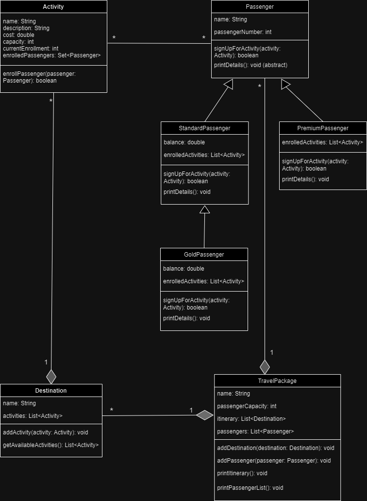
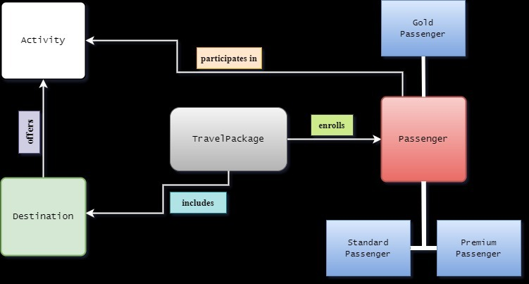

## **How to Use This Repository**

To use this repository:

1. **Clone the Repository:**
   ```bash
   git clone https://github.com/madhav1234-1234/TravelAgency.git
Replace [Your-Username] and [Repository-Name] with your GitHub username and the repository name, respectively.

Open the Project:

Open IntelliJ IDEA.
Select Open and navigate to the cloned repository folder.
Open the project folder in IntelliJ IDEA.
Run the Application:

Navigate to the Main class in the project.
Right-click on it and select Run 'Main.main()' to start the application.
Explore the Functionalities:

The application will demonstrate the setup of various travel packages with different destinations and activities.
You can modify the Main class or other classes to experiment with different scenarios.


# **Travel Package Management System (Java)**

This repository contains a Java-based system for managing travel packages. It is designed following object-oriented principles and includes unit tests for ensuring code reliability and robustness.

## **Features**

- **Manage Travel Packages:** Create travel packages with various destinations and activities.
- **Different Passenger Types:** Supports Standard, Gold, and Premium passengers with specific benefits.
- **Activity Enrollment:** Functionality for enrolling passengers in activities based on their membership type and balance.
- **Detailed Itineraries:** Ability to print comprehensive itineraries and passenger lists for travel packages.
- **Robust Unit Tests:** Extensive unit tests using JUnit for core functionalities.

## **Structure**

The system includes several classes, each focused on a specific aspect of travel package management:

- **`Activity`:** Manages individual activities within a destination.
- **`Destination`:** Represents a location within a travel package.
- **`Passenger` (Abstract):** Base class for different types of passengers.
- **`StandardPassenger`, `GoldPassenger`, `PremiumPassenger`:** Subclasses of `Passenger`, each offering unique features.
- **`TravelPackage`:** Manages the overall aspects of a travel package.
- **`Main`:** Demonstrates the setup and management of travel packages.

## **Unit Tests**

The project includes unit tests for essential classes:

- **`DestinationTest`:** Tests functionality related to the `Destination` class.
- **`PassengerTest`:** Ensures correct behavior of the passenger classes.
- **`TravelPackageTest`:** Verifies functionalities of the `TravelPackage` class.

## **Usage**

Compile and execute the `Main` class to see the system in action. It demonstrates the setup of travel packages with different destinations, activities, and passenger enrollments.

## **Contributing**

Contributions are welcome. Follow these steps:

1. **Fork the Repository:** Create your own fork of the project.
2. **Create a New Branch:** Work on your feature in a separate branch.
3. **Commit Changes:** Commit your enhancements or fixes.
4. **Submit a Pull Request:** Open a pull request with a comprehensive description of changes.


## System Design UML Diagram

Below is the UML class diagram representing the system design for a travel agency application. The diagram outlines the main classes and relationships necessary to represent the domain:

- **Activity**: Represents various activities that can be part of a travel package. It has attributes such as `name`, `description`, `cost`, and `capacity`. It includes a method to enroll passengers.

- **Passenger (Abstract Class)**: Defines the basic structure and behaviors of a passenger, with subclasses `StandardPassenger` and `PremiumPassenger` inheriting from it. It has methods for signing up for activities and printing details, with the latter being abstract, indicating that subclasses should provide their implementation.

- **StandardPassenger and GoldPassenger**: These are concrete classes derived from `Passenger` that represent different tiers of passengers with their specific attributes and behaviors.

- **Destination**: This class represents a destination in a travel package, holding a list of activities available at that destination.

- **TravelPackage**: Aggregates the entire travel package, including a list of destinations and passengers. It provides methods to add destinations and passengers and to print the itinerary and passenger list.

This diagram serves as a blueprint for implementing the system, ensuring that the software components are well-defined and adhere to object-oriented design principles.




## High-Level Design Overview

The diagram above illustrates the core components of the system:

- `TravelPackage`: The central entity representing a travel package offered by the agency. It includes multiple destinations and enrolls passengers.

- `Destination`: Represents a location within a travel package. Each destination is linked to a set of activities that passengers can participate in.

- `Activity`: Activities available at each destination. An activity has a name, description, cost, and capacity.

- `Passenger`: Abstract representation of a person enrolled in a travel package. There are specific types of passengers:

   - `StandardPassenger`: A passenger with a balance that decreases with each enrolled activity.
   - `GoldPassenger`: Similar to a standard passenger but receives a discount for activities.
   - `PremiumPassenger`: Can enroll in activities at no cost.

## Interactions

- **includes**: A `TravelPackage` includes one or more `Destinations`.
- **enrolls**: A `Passenger` enrolls in a `TravelPackage`.
- **participates in**: A `Passenger` participates in an `Activity`.

Each component and interaction is designed to fulfill the requirements specified for the travel package system, ensuring a comprehensive experience for both travel agencies and customers.



